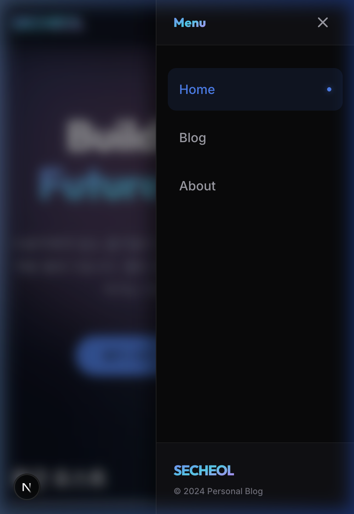

# 🚀 박세철의 퍼스널 블로그: AI 에이전트 협업 프로젝트

본 프로젝트는 **전공기초세미나** 수업의 일환으로 진행된 과제입니다. 최신 AI 에이전트(Claude, Gemini 등)와의 협업을 통해 현대적이고 프리미엄한 감성을 가진 나만의 기술 블로그를 완성하는 것을 목표로 했습니다.

---

## 🌐 라이브 사이트 (Live Demo)
프로젝트의 실제 작동 모습은 아래 링크에서 확인하실 수 있습니다.
👉 **[secheol-blog.vercel.app](https://secheol-blog.vercel.app/)**

---

## 📱 주요 레이아웃 데모
### 모바일 내비게이션 (Mobile Menu)
최근 업데이트를 통해 모바일 환경에서 직관적이고 세련된 **사이드바 드로어(Sidebar Drawer)** 형태의 메뉴를 구현했습니다.



---

## 🎨 프로젝트 컨셉: Midnight Aurora (미드나잇 오로라)
미래지향적이고 몰입감 있는 사용자 경험을 위해 **심해의 네이비와 오로라의 그라데이션**을 모티브로 삼았습니다. 단순한 정보 전달을 넘어, 방문자에게 시각적인 즐거움을 줄 수 있는 디자인을 지향합니다.

---

## 🛠 기술 스택 (Tech Stack)

### Core
- **Framework**: [Next.js 15 (App Router)](https://nextjs.org/)
- **Language**: [TypeScript](https://www.typescriptlang.org/)
- **Styling**: [Tailwind CSS 4](https://tailwindcss.com/) (최신 버전 적용)
- **Content**: [MDX](https://mdxjs.com/) (Markdown using `next-mdx-remote`)

### Design & Motion
- **Animation**: [Framer Motion](https://www.framer.com/motion/)
- **Icons**: [Lucide React](https://lucide.dev/)
- **Typography**: Outfit (Headings) & Inter (Body) from Google Fonts

---

## ✨ 핵심 기능 (Key Features)

1.  **프리미엄 다크 모드**: Midnight Aurora 테마가 적용된 세련된 다크 인터페이스.
2.  **MDX 기반 포스팅**: 로컬 마크다운 파일을 이용한 쉽고 강력한 블로그 포스트 관리.
3.  **반응형 디자인**: 모바일, 태블릿, 데스크탑 등 모든 디바이스에 최적화된 레이아웃.
4.  **글래스모피즘(Glassmorphism)**: 투명도와 블러 효과를 활용한 현대적인 내비게이션 바.
5.  **SEO 최적화**: Next.js의 메타데이터 시스템을 활용한 검색 엔진 최적화.

---

## 🤖 AI 에이전트 협업 과정 (AI Collaboration)

이번 과제는 **안티 그래비티(Antigravity)** 환경에서 AI 에이전트와 페어 프로그래밍을 진행하며 개발되었습니다. 

- **기획 및 디자인**: AI와 함께 테마 아이디어를 브레인스토밍하고, 구색만 갖춘 MVP가 아닌 프리미엄 디자인 시스템을 구축했습니다.
- **코드 생성 및 최적화**: Next.js 15의 최신 기능(Server Components 등)과 Tailwind 4의 최신 문법을 AI가 정확하게 제안하고 적용했습니다.
- **콘텐츠 및 문서화**: 자기소개(About) 페이지의 문구를 다듬고, 지금 보고 계신 이 README까지 AI와의 대화를 통해 완성되었습니다.

---

## 🚀 시작하기 (Getting Started)

로컬 환경에서 프로젝트를 실행하려면 아래 명령어를 입력하세요.

```bash
# 의존성 설치
npm install

# 개발 서버 실행
npm run dev
```

이후 브라우저에서 `http://localhost:3000`으로 접속하여 결과를 확인할 수 있습니다.

---

## 👤 연락처 (Contact)

작성자: **박세철 (Park Secheol)**
- 📧 Email: minimini010318@gmail.com
- 🐙 GitHub: [github.com/seru1027](https://github.com/seru1027)

---

> 본 프로젝트는 전공기초세미나 수업 과제의 결과물입니다. AI와 인간의 협업이 만들어낼 수 있는 창의적인 웹 경험을 목표로 제작되었습니다.
