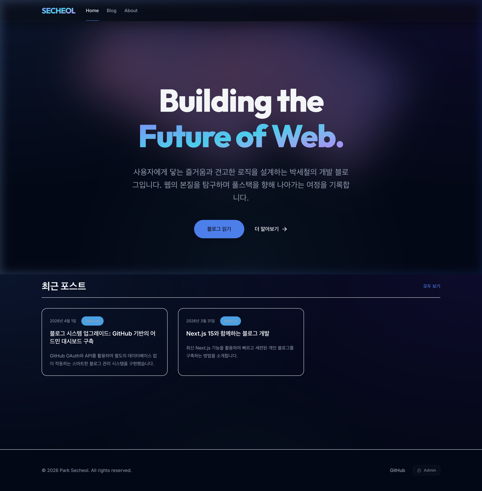
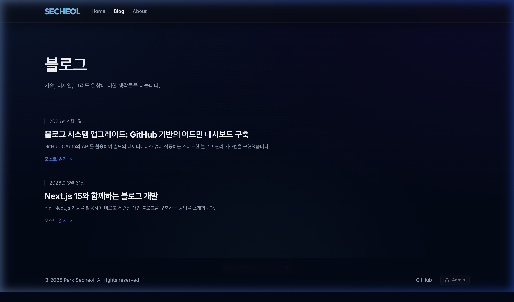
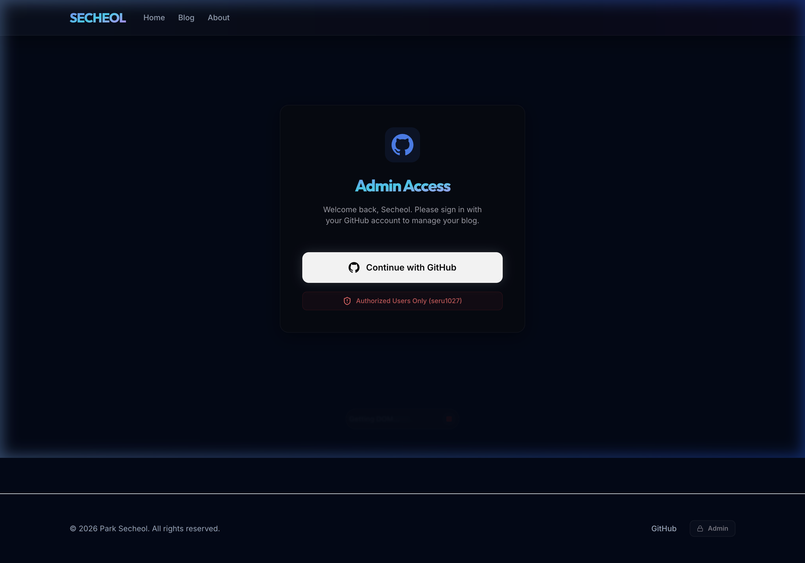
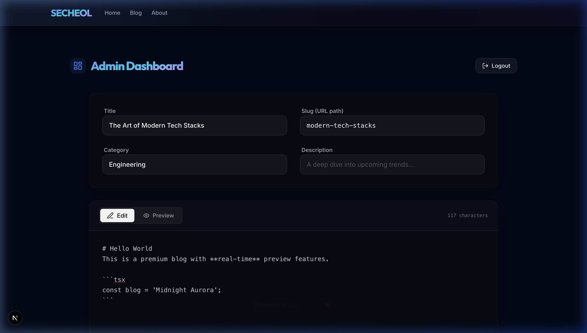
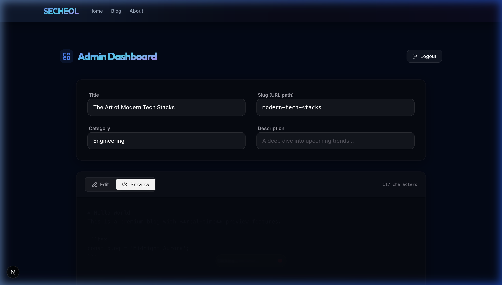

# 🌌 Secheol Blog: Midnight Aurora (AI ✕ Human 프로젝트)

본 프로젝트는 **전공기초세미나** 수업의 일환으로 진행된 과제입니다. 최신 AI 에이전트(Claude, Gemini 등)와 인간 개발자의 밀도 높은 협업을 통해, 단순히 기능만 갖춘 웹사이트를 넘어 현대적이고 프리미엄한 감성을 가진 기술 블로그를 완성하는 것을 목표로 했습니다.

---

## 🖼️ 미리보기 (Preview)


*메인 화면: Midnight Aurora 테마와 글래스모피즘이 적용된 디자인*

````carousel

<!-- slide -->

<!-- slide -->

<!-- slide -->

````
*순서대로: 블로그 포스트 목록, 어드민 로그인, 마크다운 에디터, 실시간 프리뷰*

---

## 🌐 라이브 사이트 (Live Demo)
👉 **[secheol-blog.vercel.app](https://secheol-blog.vercel.app/)**

---

## ✨ 핵심 기능 (Features)

### 1. 전용 어드민 대시보드
- **GitHub OAuth Login**: 특정 사용자(`seru1027`) 전용 보안 로그인 시스템.
- **Live Markdown Preview**: 글 작성 중 실시간으로 결과물을 확인하는 최적의 편집 환경.
- **Auto-Commit CMS**: 글 작성 즉시 GitHub API를 통해 저장소에 커밋되어 별도 DB 없이 콘텐츠 관리.

### 2. 고성능 블로그 엔진
- **Next.js 15+ App Router**: 최신 서버 컴포넌트 기반의 빠른 로딩과 SEO 최적화.
- **MDX 기반 포스팅**: 마크다운의 간결함과 리액트 컴포넌트의 유연함을 결합.
- **반응형 디자인**: 모든 디바이스에서 최적화된 "Midnight Aurora" 테마 경험.

---

## 🎨 디자인 컨셉: Midnight Aurora
미래지향적으로 몰입감 있는 사용자 경험을 위해 **심해의 네이비와 오로라의 그라데이션**을 모티브로 삼았습니다.
- **Glassmorphism**: 투명도와 블러 효과를 통한 현대적 레이아웃.
- **Aurora Light**: 은석인 동적 광원 효과를 통한 프리미엄 감성.

---

## 🤖 AI 에이전트 협업 과정 (AI Collaboration)

이번 프로젝트는 **안티 그래비티(Antigravity)** 환경에서 AI 에이전트와 페어 프로그래밍을 진행하며 개발되었습니다. 

- **기획 및 아키텍처**: "Git-as-CMS" 방식의 서버리스 블로그 구조를 AI와 함께 설계했습니다.
- **UI/UX 구현**: Tailwind CSS 4와 Framer Motion을 활용한 고난도 애니메이션 효과를 AI의 제안으로 완성했습니다.
- **문서화 및 폴리싱**: 사용자 경험을 고려한 문구 다듬기와 지금 보고 계신 README까지 협업의 결과물입니다.

---

## 🛠️ 기술 스택 (Tech Stack)

- **Framework**: Next.js 16 (App Router)
- **Language**: TypeScript
- **Styling**: Tailwind CSS, Framer Motion
- **Auth**: GitHub OAuth
- **Data Management**: GitHub REST API
- **Content**: MDX (`next-mdx-remote`)

---

## 🚀 시작하기 (Getting Started)

1. **의존성 설치**: `npm install`
2. **환경 변수 설정**: `.env.local` 파일에 아래 항목을 입력합니다.
   - `GITHUB_CLIENT_ID` / `GITHUB_CLIENT_SECRET` (OAuth App)
   - `GITHUB_TOKEN` (Personal Access Token with `repo` scope)
   - `NEXT_PUBLIC_BASE_URL` (Local: `http://localhost:3000`)
3. **개발 서버 실행**: `npm run dev`

---

## 👤 연락처 (Contact)

작성자: **박세철 (Park Secheol)**
- 📧 Email: minimini010318@gmail.com
- 🐙 GitHub: [github.com/seru1027](https://github.com/seru1027)

---

> 본 프로젝트는 전공기초세미나 수업 과제의 결과물입니다. AI와 인간의 협업이 만들어낼 수 있는 창의적인 웹 경험을 목표로 제작되었습니다.
